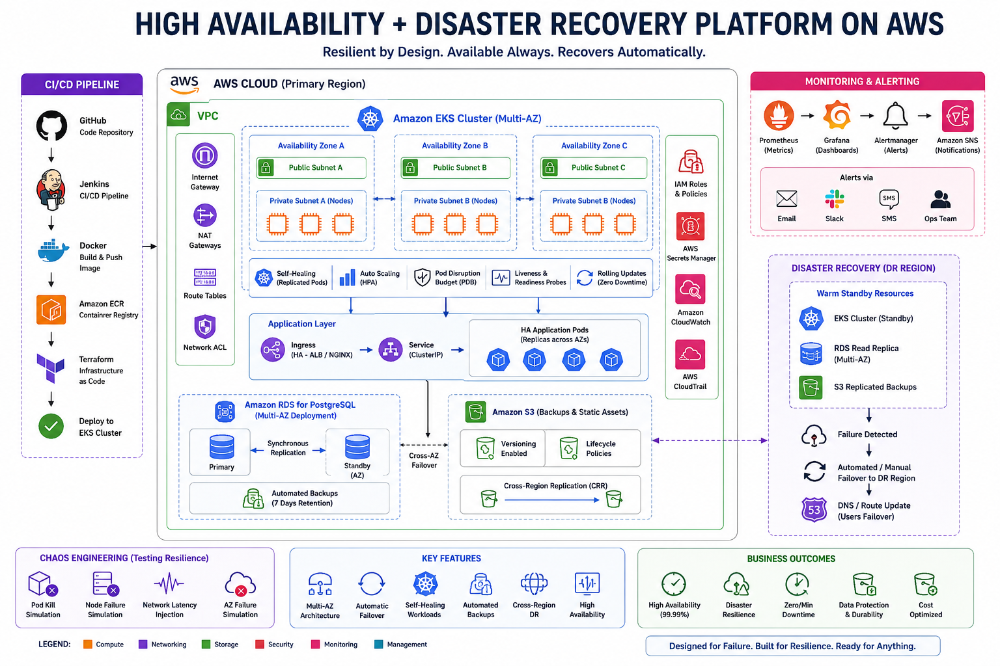

## High-Availability-and-Disaster-Recovery-Platform-on-AWS

This project demonstrates a production-grade High Availability and Disaster Recovery platform on AWS using Kubernetes and Terraform.

The platform is designed to:

- survive failures
- recover automatically
- maintain uptime
- tolerate outages
- test resilience continuously

### Core Features

- Multi-AZ EKS Deployment
- Multi-AZ RDS PostgreSQL
- Automated Backups
- S3 Versioning
- Kubernetes Self-Healing
- Horizontal Pod Autoscaling
- Chaos Engineering
- Failover Simulation
- Infrastructure as Code
- Jenkins CI/CD

### Chaos Engineering Tests

The platform intentionally triggers:

- pod failures
- node outages
- application crashes
- infrastructure disruptions

to validate recovery behavior.

### Why This Project Matters

The project goes beyond deployment and demonstrates:

- resilience engineering
- fault tolerance
- disaster recovery planning
- high availability architecture
- production survivability

This reflects how actual cloud platforms are engineered for uptime and reliability.

 ### Architecture

